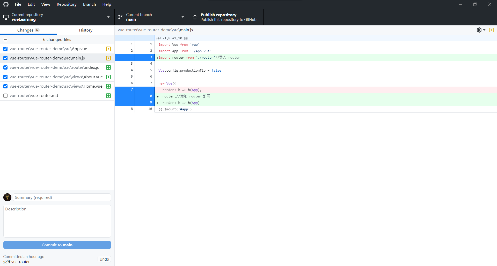

# 创建新项目

名字随意，我这里叫 **vue-router-demo** 

# 安装 vue-router

```
npm install vue-router --save
```

# 编写组件

- [About.vue](vue-router-demo\src\views\About.vue)
- [Home.vue](vue-router-demo\src\views\Home.vue)

# 编写路由

[index.js](vue-router-demo\src\router\index.js)

# 导入 router 与添加 router 配置



# 使用路由

[App.vue](vue-router-demo\src\App.vue)

  ## router-link 属性之 exact-active-class
  - 类型: string
  - 默认值: "router-link-exact-active"
  - 作用：配置当链接被精确匹配的时候应该激活的 class,简单来说就是给当前链接加个样式,在本例中体现为点击 Home、About等链接进行跳转的同时,链接变为指定样式(绿色)
  - 参考：[vue2.0中router-link详解](https://blog.csdn.net/lhjuejiang/article/details/81082090)