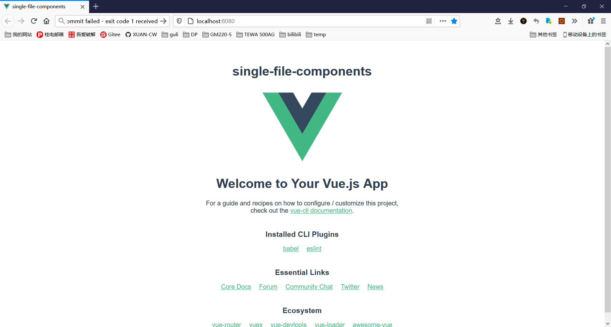

# 创建新项目

名字随意，我这里叫 **single-file-components** ，`npm run serve` 运行后见到如下效果：


# 单文件组件的使用

## 编写组件

在 **components** 目录下编写组件 [singleFileComponents.vue](./single-file-components/src/components/singleFileComponents.vue)，为了简单起见，这里只用 `template` 标签，组件内容就只有一个 `h1` 标题：

```vue
<template>
  <div>
    <h1>single-file-components</h1>
  </div>
</template>
```

## 导入与使用

编辑项目下的 `single-file-components\src\App.vue` ，导入、注册、使用 编写好的组件 [singleFileComponents.vue](./single-file-components/src/components/singleFileComponents.vue) ：


## 效果

vue 的图标上多了一句 **single-file-components**：



